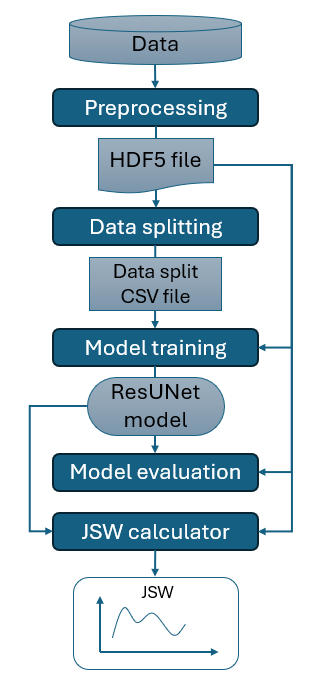
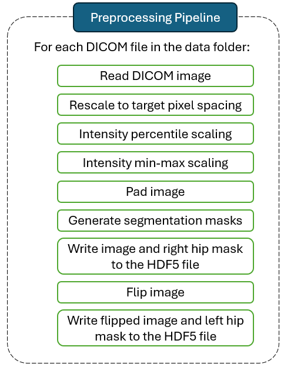

# Research-Project

## Introduction and Research Question

This repository contains the code for my Research Project taken at the end of my BSc degree in Computer Science and Engineering, with the following research topic: *"Deep Learning for Automated segmentation of the hip joint in X-ray images"*.

My research focused on addressing the following research question:

> ***How accurate is a ResUNet based deep learning approach for predicting the minimum joint space width along the weight-bearing part of the hip joint in a 2D image, in comparison to ground-truth data generated by the BoneFinder algorithm?***

More explicitly, I trained a variation of the ***U-Net*** model (commonly used in medical image segmentation tasks) incorporating residual units (from here the name of ***ResUNet***) to segment the joint space of the hip articulation, together with the femoral head and acetabular roof bones around the articulation. 
Finally, from the segmentations predicted using the trained ResUNet model, I was able to identify and measure the narrowest point across the hip joint space as the ***mJSW***  (minimum joint space width; expressed in millimeters).

To achieve the aims of my research, I constructed a code pipeline in Python, roughly structured as shown in the figure below. The pipeline is composed of 5 main modules: preprocessing, data splitting, model training, model evaluation and mJSW calculation. The following sections discuss each step of the pipeline in more detail.




## The Data

The data used to train the model consisted of X-ray images stored using the DICOM standard (stored with the `.dcm` extension). The radiographs were acquired from two cohorts, ***CHECK*** and ***OAI***, with each file representing a radiographs of a patient taken during a periodical medical visit.

For each X-ray image, the folder contains a corresponding file (with the `.dcm.pts` extension) with a list of coordinates of points outlining various pelvic bones on the radiograph. These points were generated using the BoneFinder algorithm.

The structured of the data directory is shown below, with files separated into DICOM and BoneFinder-generated points. Additionally, the X-ray samples are grouped by dataset (CHECK or OAI) and patient visit. The visit is expressed as a number, indicating the number of years from the initial visit of the patient.

```
Data folder structure:

    path/to/data
      +-- CHECK
      |  +-- T[patient visit]
      |     +-- [patient id]_T[patient visit]_APO.dcm
      |
      +-- OAI
      |  +-- V[patient visit]
      |     +-- OAI-[patient id]-V[patient visit]-[date].dcm
      |
      +-- CHECK-pointfiles
      |   +-- T[patient visit]
      |      +-- [patient id]_T[patient visit]_APO.dcm.pts
      |
      +-- OAI-pointfiles
        +-- V[patient visit]
            +-- OAI-[patient id]-V[patient visit]-[date].dcm.pts

    [patient visit] = [xx],
    [patient id]    = [xxxxxxx],
    [date]          = [yyyymmdd]

    where x, y, m, d in {0, ..., 9}
```

A dashboard of the number of files available for this research project is shown below. 

| Dataset/Visit | \# .dcm files | \# .pts files |
|---------------|---------------|---------------|
| OAI/V00       | 4707          | 4707          |
| OAI/V06       | 3638          | 3638          |
| OAI/V10       | 2946          | 2945          |
|               |               |               |
| total OAI     | 11291         | 11290         |
|               |               |               |
| CHECK/T00     | 436           | 435           |
| CHECK/T02     | 717           | 692           |
| CHECK/T05     | 882           | 826           |
| CHECK/T08     | 835           | 835           |
| CHECK/T10     | 833           | 781           |
|               |               |               |
| total CHECK   | 3703          | 3569          |
|               |               |               |
| total         | 14994         | 14859         |


## Preprocessor Module

### Description

The first phase of the pipeline is the preprocessing of X-ray images and the generation of segmentation masks (used as ground-truth labels) from BoneFinder points.
The inputs of this step consist of the path to the input data folder, a path to the output HDF5 file, and other program arguments for image processing.
The preprocessing output is written to a single HDF5 file (with the *.h5* extension).
The figure below shows the preprocessing pipeline executed for each X-ray sample.



### How to run?

To run the the preprocessing step on the DelftBlue supercomputer, run the following command in the bash terminal:
```
sbatch ./preprocessor_module/run_preprocessor.sh 
```

Alternatively, to execute the preprocessing on a regular computer, run the following command in the bash terminal (program arguments may differ):
```
python /absolute/path/to/research-project/preprocessor_module/main.py \
            --input-dir "/absolute/path/to/research-project/data" \
            --output-hdf5 "absolute/path/to/research-project/all_bg.h5" \
            --percentile-normalization 5 95 \
            --target-pixel-spacing 0.9 0.9 \
            --target-pixel-array-shape 512 512 \
            --include-background-mask \
            --verbose
```


TODO:
- How to run the code on DelftBlue;
- Data Splitter, Trainer, Evaluator and mJSW calculator modules;
- Appendix (?).